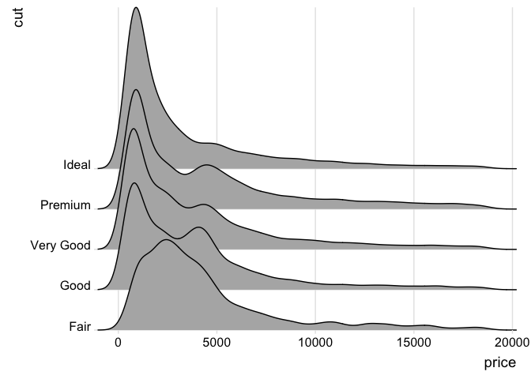

<!-- README.md is generated from README.Rmd. Please edit that file -->

# ggridges: Ridgeline plots in ggplot2

<!-- badges: start -->

[](https://travis-ci.org/wilkelab/ggridges)
[](https://ci.appveyor.com/project/clauswilke/ggridges)
[](https://codecov.io/github/wilkelab/ggridges?branch=master)
[](https://CRAN.R-project.org/package=ggridges)
[](http://cranlogs.r-pkg.org/downloads/total/last-month/ggridges)
[](https://www.tidyverse.org/lifecycle/#maturing)
<!-- badges: end -->

Ridgeline plots are partially overlapping line plots that create the
impression of a mountain range. They can be quite useful for visualizing
changes in distributions over time or space. These types of plots have
also been called
[“joyplots”](https://twitter.com/JennyBryan/status/856674638981550080),
in reference to the [iconic cover
art](https://blogs.scientificamerican.com/sa-visual/pop-culture-pulsar-origin-story-of-joy-division-s-unknown-pleasures-album-cover-video/)
for Joy Division’s album *Unknown Pleasures*. However, given the
[unfortunate origin](https://en.wikipedia.org/wiki/House_of_Dolls) of
the name Joy Division, the term “joyplot” is now discouraged.

## Installation

Please install the stable release from CRAN:

``` r
install.packages("ggridges")
```

Alternatively, you can install the latest development version from
github:

``` r
remotes::install_github("wilkelab/ggridges")
```

## Usage

``` r
library(ggplot2)
library(ggridges)
    
ggplot(diamonds, aes(x = price, y = cut)) +
  geom_density_ridges(scale = 4) + 
  scale_y_discrete(expand = c(0, 0)) +     # will generally have to set the `expand` option
  scale_x_continuous(expand = c(0, 0)) +   # for both axes to remove unneeded padding
  coord_cartesian(clip = "off") + # to avoid clipping of the very top of the top ridgeline
  theme_ridges()
#> Picking joint bandwidth of 458
```

<!-- -->

## Documentation and Examples

First read the [package
vignette.](https://wilkelab.org/ggridges/articles/introduction.html)
Then read the [reference
manual.](https://wilkelab.org/ggridges/reference/index.html)
